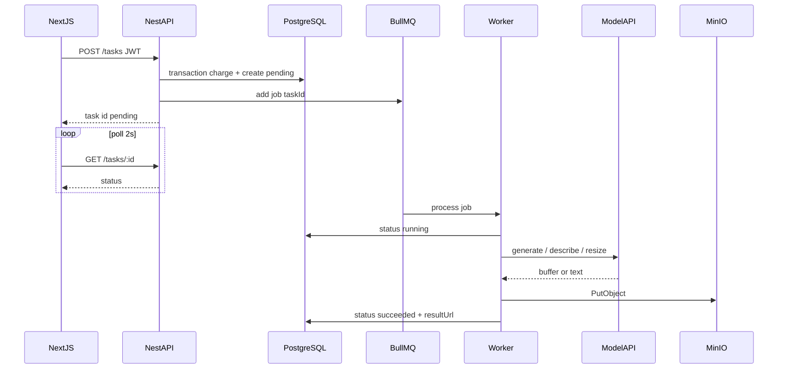

# AmosMind 架构说明

## 主链路时序

## 任务状态机

| 当前 | 允许下一状态 |
|------|----------------|
| pending | running, failed |
| running | succeeded, failed |
| succeeded | （终态） |
| failed | （终态） |

实现见 `packages/shared` 的 `canTransition` 与 `TasksService.transitionStatus`。

## 扣费规则（MVP）

- **时机**: 创建任务时扣费（`POST /tasks` 事务内）
- **金额**: `GENERATION_COST` 环境变量，默认 10
- **流水**: `CreditLedger` 负数记录 + `User.creditBalance` 递减
- **未实现**: 任务失败自动退分（第 2 周迭代）

## 模块职责

| 模块 | 职责 |
|------|------|
| auth | JWT 登录 |
| tasks | 创建任务、查询、入队 |
| generation | BullMQ Worker 执行生成 |
| credits | 扣积分 |
| storage | MinIO 上传 |
| model | 国内 API / mock 适配 |
| projects | 项目 CRUD |

## 模型适配

`MODEL_PROVIDER` 切换：

- `mock`: 本地 SVG 占位图 + 延迟
- `siliconflow`: OpenAI 兼容 images + 视觉 chat
- `dashscope`: 通义万相（需有效 key）
